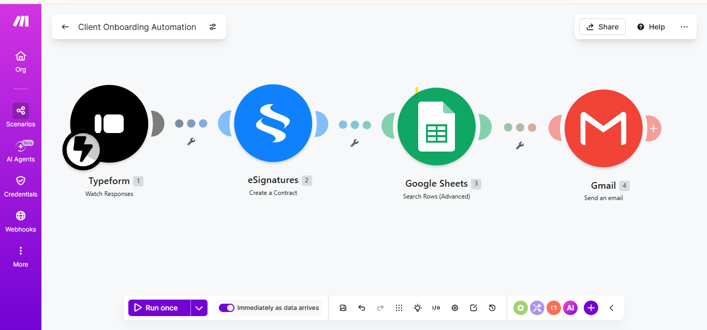

# client-onboarding-automation
Automated client onboarding workflow using Make.com, Typeform, eSignatures, Google Sheets, and Gmail

## How it works

1. **Typeform**: Watches for new form responses when a client fills out the onboarding form.
2. **eSignatures**: Automatically generates and sends a contract for the client to sign based on their submitted info.
3. **Google Sheets**: Searches/logs the client's row in a tracking sheet for internal records.
4. **Gmail**: Sends a confirmation email to the client once the process completes.

## Project structure

- `README.md`: project overview (this file)
- `client-onboarding-workflow.png`: Make.com scenario screenshot

## Tools used

- [Make.com](https://www.make.com): automation/orchestration
- Typeform: client intake form
- eSignatures: contract generation
- Google Sheets: record tracking
- Gmail: client communication

